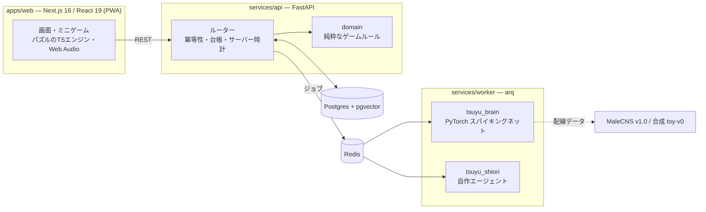

# ツユラボ Tsuyu Labo

> 本物のハエの脳で育つ。毎週1匹、卵から育てる育成研究ゲーム。

朝・昼・夜にごはんを作り、パズルでしつけ、1週間で卵を成虫まで育てる。日曜の夜は羽化と研究発表会。
育てた子は研究チームに加わり、フレンドと競い、次の世代へつながっていく。

名前の由来：ショウジョウバエの学名 *Drosophila* は、ギリシャ語で「露を好むもの」。

> **状態: アルファ版を開発中。** 企画書: [docs/spec/kikakusho-v0.2.html](docs/spec/kikakusho-v0.2.html) ／
> 開発計画: [docs/DEVELOPMENT_PLAN.md](docs/DEVELOPMENT_PLAN.md) ／ 進み具合: [docs/HANDOFF.md](docs/HANDOFF.md)

## 遊び方（1週間）

| 日 | すがた | やること |
| --- | --- | --- |
| 月 | 卵 → 1齢幼虫 | 温度あわせ、寝床づくり |
| 火〜木 | 1〜3齢幼虫 | 朝昼晩のごはんづくり（ブロックパズル）、しつけ（回路パズル）、そうじ |
| 金 | さまよう幼虫 | さなぎの場所えらび |
| 土 | さなぎ | 温度あわせ、羽化の予兆 |
| 日 | 羽化 | 研究発表会でランク → 羽化（素質・特性・突然変異） |

しつけのパズルがうまいほど、脳モデルのキノコ体のつながりが強く変わり、好き・苦手が行動に出る。

## しくみ



- **サーバーが正しさを決める**: 時刻・採点・乱数・通貨はすべてサーバー。パズルは操作の記録を送り、サーバーが再生して採点する。
  通貨は複式の台帳、状態を変える API はすべて `Idempotency-Key` 必須。
- **脳エンジン**（`services/brain`）: LIF ニューロンのスパイキングネットを PyTorch で一から実装。実在のニューロン名
  （MN9、DNp01、PAM / PPL1、MBON など）の回路で、糖→口吻を伸ばす、影→逃げる、しつけ→匂いの好みが変わる、を再現する。
  個体差ジェネレーター（生まれつきの特性）と、神経活動から行動を当てるデコーダーも自作。
- **研究員シオリ**（`services/shiori`）: フレームワークを使わない LLM エージェント。ツール呼び出し、根拠 ID の検証
  （実在しない記録を指す文は表示しない）、論文の検索（RAG）。API キーがなくても Mock で全部動く。
- **ゲームのルール**（`services/api/src/tsuyulabo_api/domain`）: DB を知らない純粋な Python。TypeScript 側と
  共有のゴールデンテスト（`packages/fixtures`）で採点の一致を保証。

## 本物・モデル・ゲームの線引き

| 区分 | 中身 |
| --- | --- |
| 本物のデータ | 神経の配線、学習がキノコ体で起きること、成長の順番、系統の見た目と遺伝のしかた |
| モデル | ニューロンの動き方（単純化）、学習ルール、神経活動から行動への変換、特性の作り方 |
| ゲーム | 1週間に縮めた成長、パズル、レベル、★、サブスキル、デフォルメした見た目 |
| AI | 研究員シオリは LLM を使ったキャラクター。ツユ自身は言葉を話さない |

## AI の評価（CI で自動）

脳エンジン `toy-v0`（合成配線での動作確認。生物学的な検証ではない）:

| チェック | 結果 |
| --- | --- |
| 糖 → MN9 | 合格（無刺激 0 Hz → 糖 327 Hz） |
| 迫る影 → DNp01 | 合格（0 Hz → 318 Hz） |
| 苦味で摂食が止まる | 合格（糖のみ 327 Hz → 糖＋苦味 0 Hz） |
| しつけで好みが変わる | 合格（ごほうびで PI +1.0、罰で −1.0。飽和気味で要調整） |
| 特性が行動に出る | 合格（右曲がりぐせ群の右旋回 60.1% vs 野生型 52.2%、p < 1e-30） |
| 行動デコーダー | 合格（本物の配線 100% ／ 配線シャッフル 73〜84%） |

本物の配線 **MaleCNS v1.0**（5 回路・約 700 KB に前処理して同梱）: 6 項目中 5 項目合格。

| チェック | 結果 |
| --- | --- |
| 糖 → MN9 | 合格（0 Hz → 2.9 Hz） |
| 迫る影 → DNp01 | 合格（0 Hz → 25.4 Hz） |
| 苦味で摂食が止まる | 合格（2.9 Hz → 1.1 Hz） |
| しつけで好みが変わる | 合格（初期 PI +0.08 → ごほうび +0.47 / 罰 −1.08） |
| 特性が行動に出る | 合格（右旋回 53.9% vs 52.4%、p = 1.4e-5） |
| 行動デコーダー | 未達（logistic 78.41% / MLP 76.70% ／ 配線シャッフル 46.02〜51.14%。基準 85%） |

ゲームの既定は引き続き `toy-v0`。匂いシナリオの修正と個体ごとの安静時活動の差し引きを行ったが、
弱い匂いや摂食の無応答によるラベルの重なりが残る。調整には訓練・検証データのみを使用し、
テスト個体 `[4, 5, 6, 10]` は固定。詳細は
[評価レポート](services/brain/reports/report-malecns.md)と
[原因・検証記録](services/brain/reports/decoder-investigation.md)。

シオリ（Mock、42 問）: 正答率 100%、根拠の検証率 100%。

## 動かす

```bash
docker compose up          # web, api, worker, postgres, redis
```

Docker なしでも動かせる:

```bash
uv sync && uv run uvicorn tsuyulabo_api.main:app --reload   # API（SQLite）
npm install && npm run dev                                    # Web (http://localhost:3000)
uv run pytest                                                 # Python のテスト
npm test                                                      # Web のテスト
uv run python scripts/smoke_api.py                            # 動いているスタックを通しで試す
```

詳しくは [docs/infra.md](docs/infra.md)。

## 開発のしかた

仕様（[docs/specs](docs/specs)）を先に書き、Claude（指揮とデザイン）と Codex（実装）が並列のブランチで作って
マージしている。コミットはアトミックに細かく分ける方針（[AGENTS.md](AGENTS.md)）。タスクごとの指示は
[docs/agent-tasks](docs/agent-tasks) に残している。

## データの出典

- 成虫オスの配線: MaleCNS v1.0（FlyEM / HHMI Janelia、University of Cambridge、MRC Laboratory of Molecular
  Biology、Google Research。CC-BY 4.0、Berg et al., 2026, Cell）— https://male-cns.janelia.org/
- 幼虫の配線: Winding et al., 2023, Science

たまごっち、ポケモンスリープはそれぞれの権利者の商標です。
