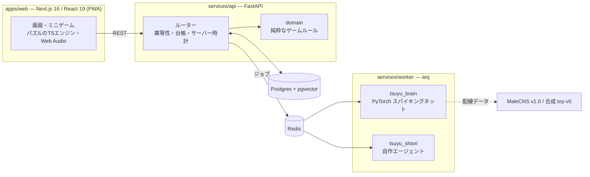

# ツユラボ Tsuyu Labo

> 本物のハエの脳で育つ。毎週1匹、卵から育てる育成研究ゲーム。

朝・昼・夜にごはんを作り、パズルでしつけ、1週間で卵を成虫まで育てる。日曜の夜は羽化と研究発表会。
育てた子は研究チームに加わり、フレンドと競い、次の世代へつながっていく。

名前の由来：ショウジョウバエの学名 *Drosophila* は、ギリシャ語で「露を好むもの」。

> **公開デモ: https://tsuyulabo.vercel.app** （ミニゲームの練習と演出のデモ。バックエンドは未公開）
> **Android アルファ版（APK）**: [v0.1.0-alpha.1](https://github.com/lingmulongtai/tsuyulabo/releases/tag/v0.1.0-alpha.1)（デバッグ署名。インストール方法はリリースノート）
>
> **状態: アルファ版を開発中。** 企画書: [docs/spec/kikakusho-v0.2.html](docs/spec/kikakusho-v0.2.html) ／
> 開発計画: [docs/DEVELOPMENT_PLAN.md](docs/DEVELOPMENT_PLAN.md) ／ 進み具合: [docs/HANDOFF.md](docs/HANDOFF.md)

## スクリーンショット

ローカルの実プレイを、スマートフォン幅（390 × 844）で撮影しています。
[全15場面・ダーク版を見る](docs/media/README.md) ／ [撮影の再現手順](docs/infra.md#readme-screenshots-and-play-video)

| 研究3日目のツユ | ごはんのライン消去 | 回路をつなぐしつけ |
| :---: | :---: | :---: |
|  |  |  |
| **1週間の研究発表会** | **育てた成虫の観察** | **糖に反応する脳の模型** |
|  |  |  |

## 遊び方（1週間）

| 日 | すがた | やること |
| --- | --- | --- |
| 月 | 卵 → 1齢幼虫 | 温度あわせ、寝床づくり |
| 火〜木 | 1〜3齢幼虫 | 朝昼晩のごはんづくり（ブロックパズル）、しつけ（回路パズル）、そうじ |
| 金 | さまよう幼虫 | さなぎの場所えらび |
| 土 | さなぎ | 温度あわせ、羽化の予兆 |
| 日 | 羽化 | 研究発表会でランク → 羽化（素質・特性・突然変異） |

しつけのパズルがうまいほど、脳モデルのキノコ体のつながりが強く変わり、好き・苦手が行動に出る。

羽化したあとも遊びは続く:

- **研究チーム**: 成虫が材料としずくを集める。好きに育てた匂いの材料をよく見つける。レベル、サブスキル。
- **交配**: 2匹から次の週の卵。white・yellow は伴性遺伝、Curly は優性でホモ致死など、遺伝は本物どおり。
- **迷路レース**: 週に1回、同じ迷路に匂いを置いて成虫を送り出す。走りは、その子の脳モデル（しつけと特性）が決める。
- **今日の回路**: 全員に同じ大きな回路パズル。フレンドとタイム勝負。
- **いっしょにねる**: おやすみ・おはようの時刻がそろうほど体内時計ゲージがたまり、チームのげんきが回復する。
- **脳ビューア**: 刺激を与えると、実在のニューロン名の細胞群が光る。
- **研究員シオリ**: 「なんで？」に、記録と、コピーで行った実験の ID つきで答える。

## しくみ



- **サーバーが正しさを決める**: 時刻・採点・乱数・通貨はすべてサーバー。パズルは操作の記録を送り、サーバーが再生して採点する。
  通貨は複式の台帳、状態を変える API はすべて `Idempotency-Key` 必須。
- **脳エンジン**（`services/brain`）: LIF ニューロンのスパイキングネットを PyTorch で一から実装。実在のニューロン名
  （MN9、DNp01、PAM / PPL1、MBON など）の回路で、糖→口吻を伸ばす、影→逃げる、しつけ→匂いの好みが変わる、を再現する。
  個体差ジェネレーター（生まれつきの特性）と、神経活動から行動を当てるデコーダーも自作。
- **研究員シオリ**（`services/shiori`）: フレームワークを使わない LLM エージェント。ツール呼び出し、根拠 ID の検証
  （実在しない記録を指す文は表示しない）、論文の検索（RAG）。API キーがなくても Mock で全部動く。
- **ゲームのルール**（`services/api/src/tsuyulabo_api/domain`）: DB を知らない純粋な Python。TypeScript 側と
  共有のゴールデンテスト（`packages/fixtures`）で採点の一致を保証。

## 本物・モデル・ゲームの線引き

| 区分 | 中身 |
| --- | --- |
| 本物のデータ | 神経の配線、学習がキノコ体で起きること、成長の順番、系統の見た目と遺伝のしかた |
| モデル | ニューロンの動き方（単純化）、学習ルール、神経活動から行動への変換、特性の作り方 |
| ゲーム | 1週間に縮めた成長、パズル、レベル、★、サブスキル、デフォルメした見た目 |
| AI | 研究員シオリは LLM を使ったキャラクター。ツユ自身は言葉を話さない |

## AI の評価（CI で自動）

脳エンジン `toy-v0`（合成配線での動作確認。生物学的な検証ではない）:

| チェック | 結果 |
| --- | --- |
| 糖 → MN9 | 合格（無刺激 0 Hz → 糖 327 Hz） |
| 迫る影 → DNp01 | 合格（0 Hz → 318 Hz） |
| 苦味で摂食が止まる | 合格（糖のみ 327 Hz → 糖＋苦味 0 Hz） |
| しつけで好みが変わる | 合格（ごほうびで PI +1.0、罰で −1.0。飽和気味で要調整） |
| 特性が行動に出る | 合格（右曲がりぐせ群の右旋回 60.1% vs 野生型 52.2%、p < 1e-30） |
| 行動デコーダー | 合格（本物の配線 100% ／ 配線シャッフル 73〜84%） |

Measured **MaleCNS v1.0** is now the default: **all six gates pass**, with five
circuits bundled in about 990 KB. The extract adds 279 real bodies, retains all
original bodies, and stays below 2,000 neurons per circuit. This evaluates the
game model, not biological validity.

| Check | Result |
| --- | --- |
| Sugar -> MN9 | Pass: 0 Hz at rest, 115.625 Hz with sugar |
| Looming -> DNp01 | Pass: 0 Hz at rest, 25.417 Hz with looming |
| Bitter suppression | Pass: 115.625 Hz sugar, 0 Hz sugar+bitter |
| Learning | Pass: baseline PI +0.098564; reward shift +0.462885 / punishment -1.098564 |
| Trait bias | Pass: right fraction 53.62% vs 52.32%; one-sided p = 0.000858 |
| Decoder | Pass: logistic **88.64%**, MLP **88.64%**; shuffled 43.75-48.86%; average drop 42.23 percentage points |

The previous measured scores were 78.41% / 76.70%. Selection used the unchanged
training/validation split; test individuals [4, 5, 6, 10] stayed held out.
Validation is still 81.82%, and weak yeast responses remain a limitation.
Versioned checkpoints and compact float16 state deltas support the measured
default; explicitly selected and persisted `toy-v0` states remain supported.
All six toy gates also pass. See the [evaluation report](services/brain/reports/report-malecns.md),
[output counts and provenance](services/brain/README.md#additional-output-census-w8),
and [investigation](services/brain/reports/decoder-investigation.md).

シオリ（Mock、42 問）: 正答率 100%、根拠の検証率 100%。

## 動かす

```bash
docker compose up          # web, api, worker, postgres, redis
```

Docker なしでも動かせる:

```bash
uv sync && uv run uvicorn tsuyulabo_api.main:app --reload   # API（SQLite）
npm install && npm run dev                                    # Web (http://localhost:3000)
uv run pytest                                                 # Python のテスト
npm test                                                      # Web のテスト
uv run python scripts/smoke_api.py                            # 動いているスタックを通しで試す
```

詳しくは [docs/infra.md](docs/infra.md)。

## 開発のしかた

仕様（[docs/specs](docs/specs)）を先に書き、Claude（指揮とデザイン）と Codex（実装）が並列のブランチで作って
マージしている。コミットはアトミックに細かく分ける方針（[AGENTS.md](AGENTS.md)）。タスクごとの指示は
[docs/agent-tasks](docs/agent-tasks) に残している。

## データの出典

- 成虫オスの配線: MaleCNS v1.0（FlyEM / HHMI Janelia、University of Cambridge、MRC Laboratory of Molecular
  Biology、Google Research。CC-BY 4.0、Berg et al., 2026, Cell）— https://male-cns.janelia.org/
- 幼虫の配線: Winding et al., 2023, Science

たまごっち、ポケモンスリープはそれぞれの権利者の商標です。
